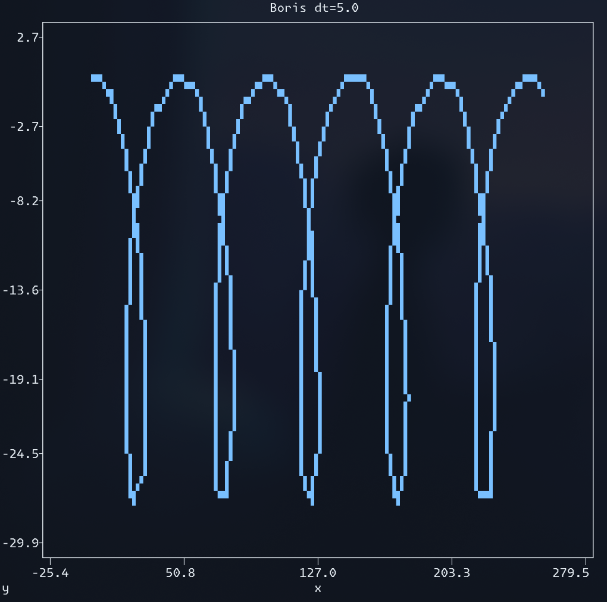
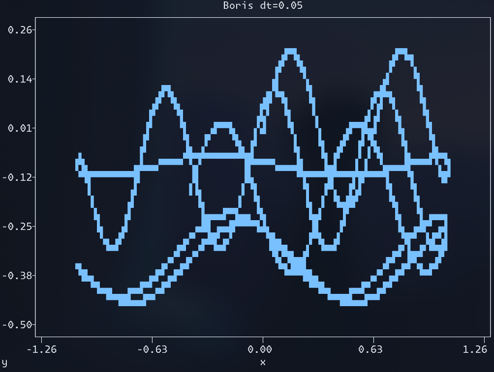
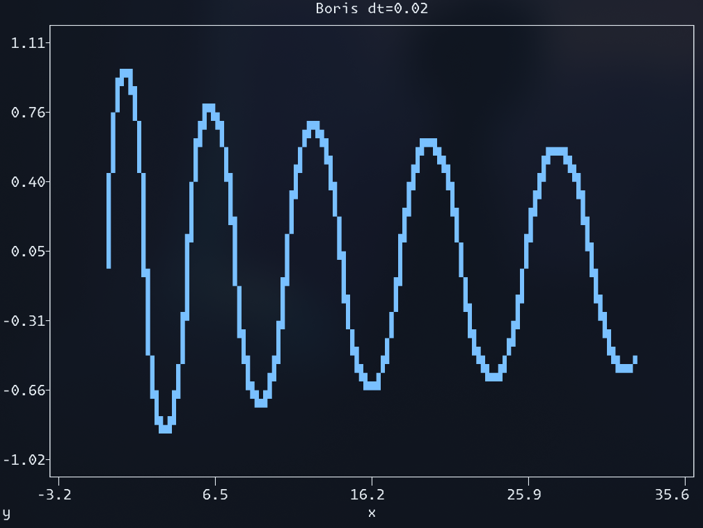

### usage

first deploy the virtual python environment and install all the dependencies:

```sh
# either use the built-in script:
./deploy.sh

# or do it manually
python3 -m venv .venv
source .venv/bin/activate
pip install numpy plotext
```

use the script to run the particle pusher with given params and plot:

```sh
python3 push.py [ARGS]
```

### things to try

1. play with the `--method [METHOD]` flag trying different options, and vary the `--dt [TIMESTEP]`
2. use predefined fields with `--preset [PRESET]`, e.g., `--preset mirror`
3. try custom fields with `--e [EFIELD]` and `[--b [BFIELD]`, e.g., `--b 0.0,0.0,2.0+np.tanh(y)` (go crazy)

### examples

```sh
python push.py --method boris --dt 5.0 --size 80 40 --u0 20.0 0.0 0.0 --tmax 500 --emag 0.5
```



```sh
python push.py --method implicit --u0 0.05 0.1 0.0 --tmax 150 --preset mirror --dt 0.05
```



```sh
python push.py --method boris --u0 0.0 1.0 0.0 --x0 0.0 0.0 0.0 --tmax 40 --preset betatron --dt 0.02
```



### all options

all the possible arguments are listed below:
```sh
usage: push.py [-h] [--method {euler,implicit,rk4,boris}] [--dt DT] [--tmax TMAX] [--x0 X0 X0 X0] [--u0 U0 U0 U0] [--e E] [--b B] [--size SIZE SIZE] [--xlim XLIM XLIM] [--ylim YLIM YLIM]
               [--preset {mirror,ExB,gradB,betatron,None}] [--xaxis XAXIS] [--yaxis YAXIS]

Run ExB tests

options:
  -h, --help            show this help message and exit
  --method {euler,implicit,rk4,boris}
                        Integration method to use
  --dt DT               Time step for integration
  --tmax TMAX           Maximum time for integration
  --x0 X0 X0 X0         Initial position: x, y, z
  --u0 U0 U0 U0         Initial 4-velocity: ux, uy, uz
  --e E                 Electric field [format: ex,ey,ez; can use expressions with x, y, z, t]
  --b B                 Magnetic field [format: bx,by,bz; can use expressions with x, y, z, t]
  --size SIZE SIZE      Dimensions of the plot
  --xlim XLIM XLIM      X-axis limits
  --ylim YLIM YLIM      Y-axis limits
  --preset {mirror,ExB,gradB,betatron,None}
                        preset E, B configuration
  --xaxis XAXIS         Quantity for x-axis
  --yaxis YAXIS         Quantity for y-axis
```
